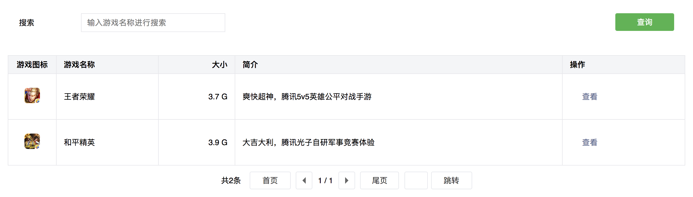

WeComponents 是一个基于通用组件语言规范 (CLS) 实现的 Vue.js 声明式组件库，写完 JSON 就做好了页面，让开发更简单。</p>

[](https://github.com/Tencent/WeComponents/blob/master/LICENSE) [](https://travis-ci.org/Tencent/WeComponents) [](https://coveralls.io/github/Tencent/WeComponents?branch=master) [](https://www.npmjs.com/package/@weadmin/wecomponents)

## 特点

设计思想上，以实现通用组件语言规范 CLS 为核心，即“将所有组件抽象为统一模型”，详见[通用组件语言规范(CLS)](CLS.md)。

**数据驱动**
* UI 也是数据
* 以数据结构描述组件
* 以组件描述页面

**开发者友好**
* 低门槛，学习了一种组件语言，就学会了整个组件库的使用
* 易理解，易记忆，易使用

**语义化**
* 符合一般人对功能的认知
* 合适的场景，合适的支持

目前主要包含表单、列表、图表三类组件的实现，更多请查看[说明文档](https://tencent.github.io/WeComponents/)。

## 使用说明

以 Vue.js 为例：

```javascript
// 1. 引入组件库
import WeComponents from '@weadmin/wecomponents';

// 2. 声明页面组件
let pageFields = [
    {
        component: 'input',
        label: '标题'
    }
];

// 3. 数据绑定
export default {
    data(){
        return {
            // 初始化组件库
            page: new WeComponents(this, pageFields)
        }
    }
};
```


## 案例展示

以一个常见的查询列表需求为例。完整代码见[demo工程](https://github.com/weadmin/WeComponentsDemo)。

**需求背景**：提供一个*搜索框*，点击*查询按钮*后，展示*结果列表*，需要支持*翻页*。

**效果展示**：



**组件声明**：

```javascript
[
    {
        "component": "container",
        "items": [
            {
                "component": "form",
                "attributes": { "layout": "row" },
                "items": [
                    {
                        "name": "search",
                        "label": "搜索",
                        "component": "input",
                        "attributes": { "placeholder": "输入游戏名称进行搜索" }
                    },
                    {
                        "label": "查询",
                        "component": "submit",
                        "attributes": { "type": "primary" },
                        "events": { "submitEventName": "searchTable" }
                    }
                ]
            },
            {
                "id": "list",
                "component": "table",
                "attributes": { "placeholder": "暂无数据", "pagination": "default" },
                "items": [
                    {
                        "name": "icon",
                        "label": "游戏图标",
                        "attributes": { "width": 60, "textAlign": "center" },
                        "valueFilterName": "iconFilter"
                    },
                    { "name": "name", "label": "游戏名称" },
                    {
                        "name": "size",
                        "label": "大小",
                        "attributes": { "textAlign": "right" },
                        "valueFilterName": "sizeFilter"
                    },
                    { "name": "intro", "label": "简介" },
                    {
                        "label": "操作",
                        "name": "option",
                        "valueFilterName": "optionFilter"
                    }
                ],
                "value": [
                    {
                        "icon": "http://mmocgame.qpic.cn/wechatgame/HurH4elIxzLGX0FjtUic0kcQtloVbicTO6LVjWicWYwrIvUBSsve2KWz40jS2MFM5Zu/0",
                        "name": "王者荣耀",
                        "size": 3675556864,
                        "intro": "爽快超神，腾讯5v5英雄公平对战手游"
                    },
                    {
                        "icon": "https://mmocgame.qpic.cn/wechatgame/duc2TvpEgSTLicunKH0MgcMLa8jicfvBvEXiaNAIReHzQJxhsibvgbVpIKtibgV8UcMEO/0",
                        "name": "和平精英",
                        "size": 3898905600,
                        "intro": "大吉大利，腾讯光子自研军事竞赛体验"
                    }
                ]
            }
        ]
    }
]
```


## 参与贡献

如果你有好的意见或建议，欢迎给我们提 Issues 或 Pull Requests。
详见：[CONTRIBUTING.md](./CONTRIBUTING.md)

[腾讯开源激励计划](https://opensource.tencent.com/contribution) 鼓励开发者的参与和贡献，期待你的加入。

## License

所有代码采用 [MIT License](http://opensource.org/licenses/MIT) 开源，可根据自身团队和项目特点 `fork` 进行定制。 
